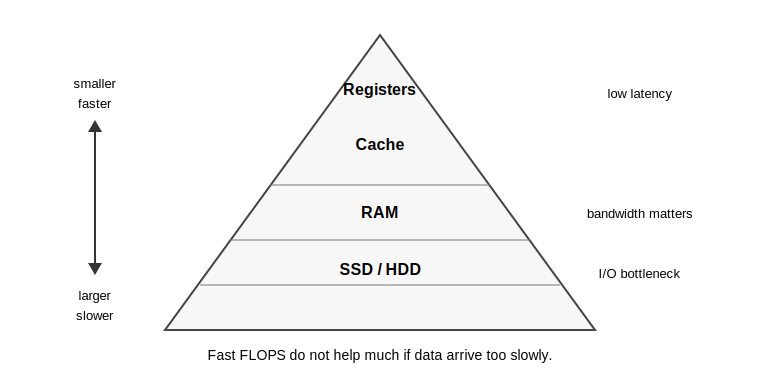

## Explanation

This page belongs to the performance and systems model. On a first pass, you may read Section 3 and then continue to Section 5, returning here when speed and memory traffic become important.

Performance is not determined only by the number of arithmetic operations. A processor may be able to perform many floating-point operations per second, but the calculation can still be slow if data arrive from memory too slowly. On modern computers, many scientific programs are limited by memory bandwidth before they reach peak FLOPS.

{fig-alt="Registers and cache are small and fast; RAM and storage are larger and slower."}

A useful rough order is:

1. Registers and cache are fastest.
2. RAM is slower.
3. SSD/HDD access is much slower.

Bandwidth is how much data can move per unit time. Latency is the delay before data arrive. Cache locality means using data that are close together in memory so that cache works well.

For high performance, it is often more important to reduce memory transfer than to reduce the number of floating-point operations. Blocking, also called tiling, is a common idea: split a large computation into smaller blocks so that reused data stay in cache. For dense matrix operations, a practical rule is to use the system-optimized BLAS and LAPACK libraries instead of writing the inner loops yourself. Julia and Python numerical libraries usually call BLAS/LAPACK internally for standard matrix operations, which is one reason built-in linear algebra can be much faster than simple hand-written loops.

## Things to look up

- FLOPS
- Memory bandwidth
- Cache
- Latency
- Cache locality
- Blocking / tiling
- [BLAS](https://netlib.org/blas/)
- [LAPACK](https://netlib.org/lapack/)

## Exercise

Consider two programs that perform the same number of additions over a large array. One reads memory in order. The other jumps through memory with a large stride. Which one do you expect to be faster, and why?

## Notes for the exercise

- Do not explain performance only by counting arithmetic operations.
- Mention memory access order.
- Mention cache locality.
- Distinguish bandwidth from FLOPS.
- Connect this idea to large arrays in scientific computing.
