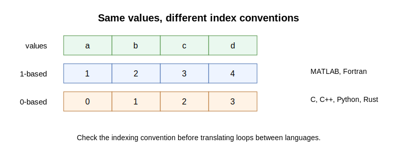

## Explanation

An index specifies the position of an element. Different languages use
different conventions. Rust, C, C++, and Python use 0-based indexing. MATLAB and
Fortran use 1-based indexing.

{fig-alt="The values a, b, c, d have indices 1, 2, 3, 4 in 1-based indexing and 0, 1, 2, 3 in 0-based indexing."}

This is a common source of off-by-one errors. If an AI agent gives a MATLAB or
Fortran example, you must check index conventions before translating it to
Rust.

```rust
let xs = [10, 20, 30];
let first = xs[0]; // 10 in Rust
```

## Things to look up

- 0-based indexing
- 1-based indexing
- Off-by-one error
- Array slicing
- Rust array indexing
- MATLAB array indexing
- Fortran array indexing

## Exercise

For the values `[10, 20, 30, 40, 50]`, answer:

1. In 1-based indexing, what are the indices of `20` and `50`?
2. In 0-based indexing, what are the indices of `20` and `50`?
3. In Rust, how would you refer to the first element?
4. Why can copying loop bounds from MATLAB or Fortran to Rust be wrong?

## Notes for the exercise

- Distinguish the value from the index.
- Check the first index used by the language.
- Watch both start and end points of ranges.
- If AI translates code between languages, inspect every index and loop bound.
