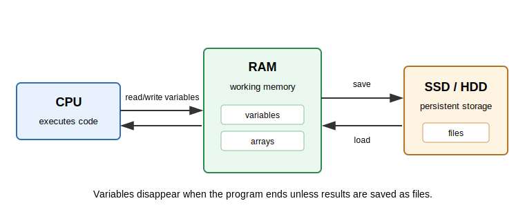

## Explanation

A running program mainly works with data in memory. Files live on persistent storage such as SSD or HDD. This distinction matters because a value stored only in memory disappears when the program ends, while a saved file can be inspected later.

{fig-alt="CPU works with variables in RAM; files are stored on SSD or HDD and loaded or saved."}

In scientific computing, this is why saved results should include parameters, random seeds, and metadata. A number printed to the screen is easy to lose. A result file can be checked, compared, and regenerated.

## Things to look up

- RAM
- SSD
- HDD
- File
- Metadata

## Exercise

Classify each item as usually being in memory, on storage, or moving between them:

- a variable inside a running Julia function,
- a large array used during a calculation,
- a `.jl` source file,
- a saved result file,
- a plot shown on screen but not saved.

## Notes for the exercise

- Do not confuse a variable with a saved file.
- Explain what is lost when the program exits.
- Explain why saving metadata helps reproducibility.
- If an AI agent writes a script, check whether important results are saved or only printed.
