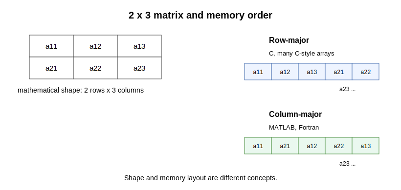

## Explanation

A multidimensional array has a shape, such as `2 x 3`. The same mathematical
shape must still be stored in one-dimensional computer memory. The order used
for storage is called memory layout.

{fig-alt="A 2 by 3 matrix has different linear memory order in row-major and column-major layouts."}

Shape and memory layout are different concepts. A tensor also has metadata that
describes how indices map to the owned data buffer. This metadata includes the
shape and may include strides. A stride says how far to move in the underlying
buffer when one index changes by one.

MATLAB and Fortran use column-major layout. C and many C-style arrays use
row-major layout. Rust itself does not have one built-in multidimensional array
type. In this course, the standard Rust path for 2D and higher numerical arrays
is `tenferro::TypedTensor`, unless an exercise explicitly asks for a flat-buffer
implementation. `ndarray` is also common in the Rust ecosystem.

Nested vectors such as `Vec<Vec<f64>>` are a poor default for numerical arrays:
rows may be stored separately, lengths can differ, and the layout is not one
simple contiguous tensor buffer.

For an N-dimensional array written as `A[i1, i2, ..., iN]`, column-major layout
makes the leftmost index `i1` change fastest in contiguous memory. Row-major
layout makes the rightmost index `iN` change fastest.

This matters for performance because memory access order affects cache
locality.

## Things to look up

- Shape
- Stride
- Row-major layout
- Column-major layout
- Tensor metadata
- Contiguous buffer
- `tenferro::TypedTensor`
- `ndarray`
- Fastest-varying index
- Cache locality
- Loop order

## Exercise

For a `2 x 3` matrix with entries `a11, a12, a13` on the first row and
`a21, a22, a23` on the second row:

1. Write the row-major memory order.
2. Write the column-major memory order.
3. State which convention MATLAB and Fortran use.
4. For a 3-dimensional array `A[i, j, k]`, state which index changes fastest in
   row-major layout and which index changes fastest in column-major layout.
5. Explain why a tensor type with shape and stride metadata is usually better
   than nested vectors for numerical arrays.

## Notes for the exercise

- Do not confuse mathematical matrix notation with memory layout.
- State the shape separately from the storage order.
- State what metadata is needed to interpret the buffer.
- For N-dimensional arrays, say which index is fastest-varying instead of
  relying only on the words row and column.
- Use `tenferro::TypedTensor` as the default Rust representation for 2D and
  higher numerical arrays in this course.
- Explain why access order can affect performance.
