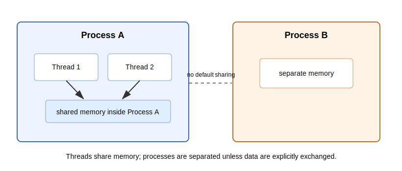

## Explanation

A process is a running program with its own memory space. A thread is an execution path inside a process. Threads in the same process usually share memory, while different processes usually do not share memory unless data are explicitly exchanged.

{fig-alt="Two threads in one process share memory; a different process has separate memory."}

This matters for parallel scientific computing. Threads can communicate through shared arrays, but this also means they can accidentally write the same data at the same time. Processes are more isolated, but moving data between them has a cost.

## Things to look up

- Process
- Thread
- Shared memory
- Race condition
- Parallel computing

## Exercise

Compare two ways to run four independent simulations:

- four processes, each with its own memory,
- four threads inside one process.

For each approach, list one advantage and one possible problem.

## Notes for the exercise

- State whether memory is shared or separated.
- Mention the cost of moving or copying data.
- Mention race conditions for shared-memory code.
- Do not assume parallel code is automatically faster or more reproducible.
