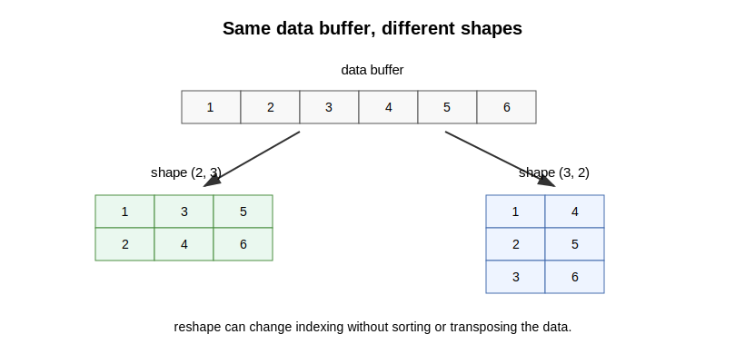

## Explanation

`reshape` changes how data are indexed as an array with a different shape. It does not necessarily sort, transpose, or copy the data. Often it is better to think of reshape as changing the view of a data buffer.

{fig-alt="The same one-dimensional data buffer can be viewed as shapes 2 by 3 and 3 by 2."}

A copy creates a new data object. A view refers to existing data with a different way to access it. A transpose swaps axes mathematically; it is not the same idea as reshape.

The exact behavior depends on the language and operation, so always check whether an operation copies data or shares data.

## Things to look up

- `reshape`
- View
- Copy
- Transpose
- Data buffer

## Exercise

Suppose the data buffer is `[1, 2, 3, 4, 5, 6]`.

1. Draw one possible `2 x 3` reshaped view using column-major order.
2. Draw one possible `3 x 2` reshaped view using column-major order.
3. Explain why reshape is not the same as sorting.
4. Explain why reshape is not the same as transpose.

## Notes for the exercise

- State whether data are copied or shared if you know the operation.
- Do not assume a new array is always allocated.
- Do not confuse shape change with element reordering.
- In Julia, connect this topic to `reshape`, `copy`, and views when you later inspect code.
