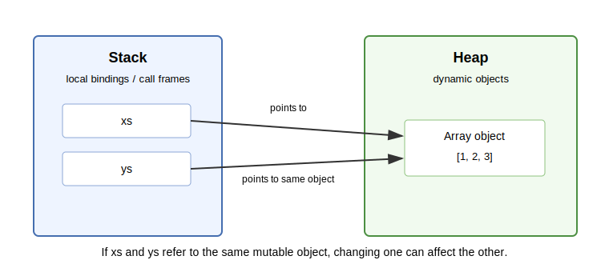

## Explanation

Stack and heap are simplified words for different kinds of memory use. You do not need to memorize implementation details here. The important idea is that small local bindings and call frames are different from large or dynamically created objects such as arrays.

{fig-alt="Two local names on the stack point to the same array object on the heap."}

This helps explain aliasing. If two names refer to the same mutable object, changing the object through one name can affect what the other name sees.

```julia
xs = [1, 2, 3]
ys = xs
push!(ys, 4)
xs  # [1, 2, 3, 4]
```

## Things to look up

- Stack memory
- Heap memory
- Reference
- Aliasing
- Mutable object

## Exercise

For the Julia code above, draw names and objects. Which names exist? Which object do they refer to? What changes after `push!(ys, 4)`?

## Notes for the exercise

- Distinguish changing a name from changing an object.
- Do not assume assignment always creates a copy.
- Explain why aliasing can be useful and why it can be dangerous.
- For scientific code, mention one bug that aliasing could cause.
