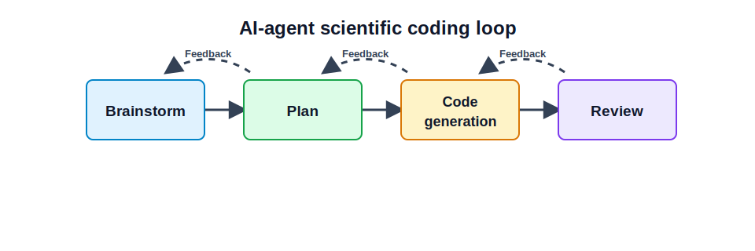

## Explanation

An AI agent can write code, tests, explanations, and logs. That does not remove the need for human review. The core workflow is a loop: brainstorm, plan, generate code, review, and give feedback.

{fig-alt="AI-agent scientific coding loop: brainstorm, plan, code generation, and review and feedback. Forward arrows are solid; backtracking arrows are dotted."}

Do not start from code generation. First clarify the scientific problem, assumptions, inputs, outputs, edge cases, tests, and acceptance criteria. After the agent changes code, review tests first, then review the diff. Feedback should be specific and evidence-based: point to failed tests, missing validation, unclear assumptions, or code that is too complex to test.

A useful review prompt is specific:

```text
Review the diff. Check whether the function inputs, output,
side effects, tests, and saved metadata match the specification.
List missing validation checks before changing code.
```

## Things to look up

- Agentic coding
- Code review
- Work log
- Test report
- Validation report

## Exercise

Write a checklist of ten items to inspect after an AI agent changes code for a scientific calculation. Then write three review prompts that are more specific than "Is this correct?"

## Notes for the exercise

- Include diff review.
- Include tests.
- Include validation against known results or sanity checks.
- Include reproducibility information.
- Include the connection between code changes and numerical results.
- Do not accept "it runs" as sufficient evidence.
